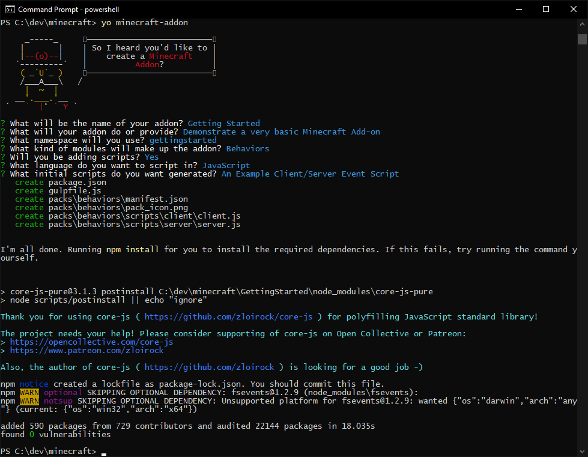
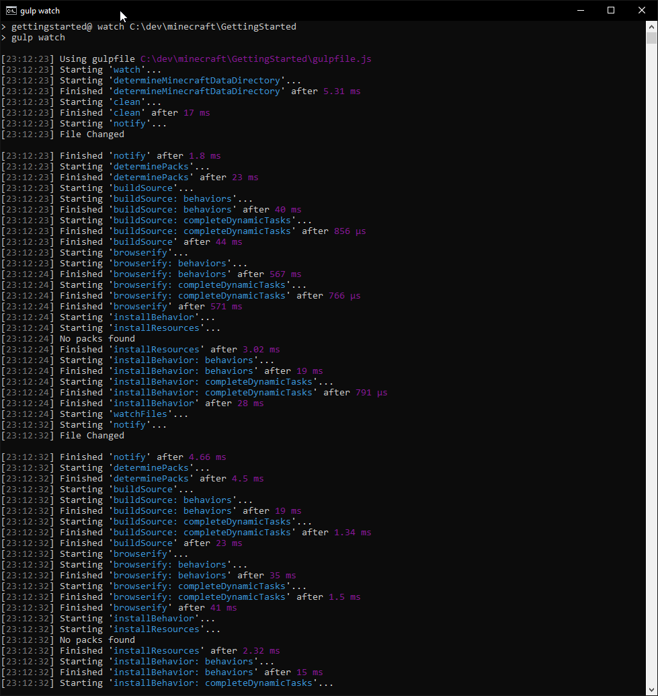

Description: Installing the tools necessary to start developing Bedrock Scripts
Published: 2018/12/16
Category: " Beginning"
Order: 1
Author: Steven Blom

---

About
===
You're about to embark on a journey of extending Minecraft to add functionality and content that the original creators had not imagined that the 
game would be used for.

On the 24th of October, the scripting documentation was released to the public for review, and the scripting API made available to a small focus 
group to test it out (versions 1.8.0.50 and 1.8.0.51), then on the 5th of December, the API was given to the public beta community.

It is now possible for anybody to participate in the beta and write your own scripts for minecraft, and this tutorial series is here to help get 
you started.

Where to go for help?
===
There is a community dedicated to Bedrock Add-on development in Discord: https://discord.gg/46JUdQb

Pre-requisites
===
In order to develop a script add-on, you will need a number of things. At [minecraft-addon-tools](http://github.com/minecraft-addon-tools/), we 
provide additional tools to make it easier to make it easier and faster to make your add-on.

The bare minimum you will need are the Mojang recommended requirements:

| Software    | Minimum                                                                                                        | Recommended                                                                                                                                                                                                     |
|-------------|----------------------------------------------------------------------------------------------------------------|-----------------------------------------------------------------------------------------------------------------------------------------------------------------------------------------------------------------|
| Code Editor | [Visual Studio Code](https://code.visualstudio.com/) or any plain-text editor                                  | [Visual Studio Community 2017](https://visualstudio.microsoft.com/vs/) with the following components installed: 'JavaScript diagnostics', 'JavaScript and TypeScript language support', 'Just-In-Time debugger' |
| Debugger    | N/A                                                                                                            | Visual Studio Community 2017                                                                                                                                                                                    |
| Minecraft   | [Minecraft on your Windows 10 device](https://www.microsoft.com/en-us/p/minecraft-for-windows-10/9nblggh2jhxj) | [Minecraft on your Windows 10 device](https://www.microsoft.com/en-us/p/minecraft-for-windows-10/9nblggh2jhxj)                                                                                                  |
| Other       | Vanilla Behavior Pack available from https://aka.ms/MinecraftBetaBehaviors                                     | Vanilla Behavior Pack available from https://aka.ms/MinecraftBetaBehaviors                                                                                                                                      |
| Storage     | 1.0 GB of free space for text editor, game, and scripts                                                        | 3.0 GB of free space for Visual Studio, game, and scripts                                                                                                                                                       |

To use the additional tools we provide, you will need some additional dependencies

| Software | Minimum | Recommended                  |
|----------|---------|------------------------------|
| Node JS  | 10.14.2 | The most recent 10.x release |

It's highly recommended that when you install Node JS, you leave the option "Add to PATH" selected.

As of the time of writing, the scripting API is in public Beta. That means that you will need to follow the Mojang guide to get signed up for 
the public beta. 

[https://minecraft.net/en-us/article/how-get-minecraft-betas](https://minecraft.net/en-us/article/how-get-minecraft-betas)


Creating your first Add-on
===
Now that you have all the tools installed, it's time to create your first add-on.

To get started quickly, we'll be using [generator-minecraft-addon](https://github.com/minecraft-addon-tools/generator-minecraft-addon), which 
is a generator for [yeoman](http://yeoman.io), which itself is a tool made for quickly putting together a project.

Start by installing both of these tools globally.
```powershell
# install yeoman
npm install --global yo
# install the minecraft add-on generator
npm install --global generator-minecraft-addon
```

With these installed, we'll need a directory on your computer to develop your code in, so create a directory and enter it, for the sake of 
this tutorial, we'll be using `C:\Dev\Minecraft`

```powershell
mkdir \Dev\Minecraft
cd \Dev\Minecraft
```

Now we can create our add-on. `generator-minecraft-addon` will ask you a number of questions about your add-on and how you wish to develop it, 
this information will be used to both structure the add-on directories and create the various files that Minecraft will use to identify the add-on.

```powershell
yo minecraft-addon
```
| Prompt                                                                | Description                                                                                                   | Answer                                      |
|-----------------------------------------------------------------------|---------------------------------------------------------------------------------------------------------------|---------------------------------------------|
| `What will be the name of your addon?`                                | This will be the name displayed in Minecraft when players select your add-on                                  | `Getting Started`                           |
| `What will your addon do or provide?`                                 | This will be the description displayed in Minecraft when the player selects your add-on                       | `Demonstrate a very basic Minecraft Add-on` |
| `What namespace will you use?`                                        | The namespace helps to separate your add-on's functionality from other add-ons so they do not collide          | `gettingstarted`                            |
| `What kind of modules will make up the addon? (Behaviors, Resources)` | This warrants a full explanation, see below                                                          | `Behaviors`                                 |
| `Will you be adding scripts?`                                         | It's possible to create an add-on that does not use scripts, however we will be using scripts for this series. | `Yes`                                       |
| `What language do you want to script in?`                             | This warrants a full explanation, see below                                                          | `JavaScript`                                |

An example of the output should look like this:



Behaviors and Resources
---
Minecraft addons are made up of two main concepts:
* **Behavior packs** which modify the way the game behaves:
  * Modify AI of mobs or define the AI of a new mob
  * Script new logic or write mini-games
  * Change the contents of loot containers
  * Create .mcfunctions 
* **Resource packs** which modify the how the game looks:
  * Create a texture pack to re-theme blocks and items
  * Change the design and/or animation of mobs
  * Create the design and animation for a new mob
  * Modify shaders and add visual effects

For the sake of this first tutorial, we do not need to change the looks, we simply want to test out and make sure that you are configured to 
run a script.

*The use of the term `behavior` follows US spelling, in order to save on confusion it will always be referred to in the same spelling as in 
the official documentation in order to avoid something breaking because of the spelling being wrong*

Scripting Languages
---
When setting up your add-on, you will have been presented with at least two options, JavaScript and TypeScript.

JavaScript is the add-on scripting language. It is a very widely used language, most commonly used in your web browser. It has been around in 
various forms since May 1995, with many new revisions and additions made to the language in the years since. At the time of writing, Minecraft 
supports the features that were introduced in EcmaScript 5.1 (EcmaScript being the specification for JavaScript versions).

Despite it's ubiquity, it does have a reputation in some circles for being very easy to write code that is buggy or doesn't work at all. To help 
with that, [minecraft-addon-tools](http://github.com/minecraft-addon-tools/) provides definitions for a language called TypeScript. The best 
description I've read about can be found on Stack Overflow ([What is TypeScript and why would I use it in place of JavaScript](https://stackoverflow.com/questions/12694530/what-is-typescript-and-why-would-i-use-it-in-place-of-javascript/35048303#35048303)): 
`TypeScript is modern JavaScript + types. It's about catching bugs early and making you a more efficient developer, while at the same time leveraging 
the JavaScript community.`

TypeScript is converted into JavaScript, and although it helps to write less buggy code, it does add an additional layer of complexity that will be avoided for these tutorials.

You can expect that resources from Mojang and other places around the community will be written in JavaScript.

A quick tour of your new add-on
===
Now that your add-on has been created, Open your IDE in the newly created directory `C:\Dev\Minecraft\GettingStarted`

The project has been laid out according to the expected layout of the [minecraft-addon-toolchain](https://github.com/minecraft-addon-tools/minecraft-addon-toolchain) 
package that we provide.

The tool chain provides the following features:
* Adds support for languages other than JavaScript
* Creates directories in the `.mcpack` format.
* Installs the add-on into Minecraft
* Watches for changes to files and automatically updates.
* Builds `.mcpack` and `.mcaddon` files for you

We'll use the tool chain in a moment, but first let's look at each file and directory in the project and what it's for.

| Path                         | Purpose                                                                                                                                                                                                                      |
|------------------------------|------------------------------------------------------------------------------------------------------------------------------------------------------------------------------------------------------------------------------|
| node_modules/                | This is where `minecraft-addon-toolchain` and it's dependencies live.                                                                                                                                                    |
| packs/                         | The files that make up your add-on will be somewhere under this directory.                                                                                                                                                    |
| packs/behaviors/               | This is where the files that make up the behavior pack will live. This does not include scripts, they are currently stored separately                                                                                        |
| packs/behaviors/manifest.json  | This file is used by Minecraft to identify the behavior pack for your add-on, It provides the name and description for users to see                                                                                          |
| packs/behaviors/pack_icon.png  | This icon is used to identify your add-on. You should change this as soon as possible                                                                                                                                         |
| packs/behaviors/scripts/client/          | This is where scripts that need to run on your computer will live.                                                                                                                                                           |
| packs/behaviors/scripts/client/client.js | This is the example client side script. It has some basic code, but does not do anything.                                                                                                                                    |
| packs/behaviors/scripts/server/          | Most of the game logic happens on the server, which could be your computer, a friend's computer or a dedicated server, and this is where those server-side scripts will live.                                                |
| packs/behaviors/scripts/server/server.js | This is the example server side script. It has some basic code, but does not do anything.                                                                                                                                    |
| gulpfile.js                  | This file is part of the `minecraft-addon-toolchain`, which is built on top of a system called `gulp`. It is highly configurable, but the version that is provided by `generator-minecraft-addon` starts off very basic. |
| package-lock.js              | This is used by `npm`, part of Node JS to keep track of `minecraft-addon-toolchain`'s version and dependencies.                                                                                                          |
| package.js                   | This is used by `npm`, part of Node JS to define what version of `minecraft-addon-toolchain` and the commands you can run that make development of your add-on easier.                                                    |

If we had created the add-on with resources, there would have been additional files and directories.

| Path                        | Purpose                                                                                                                             |
|-----------------------------|-------------------------------------------------------------------------------------------------------------------------------------|
| packs/resources/              | This is where the files that make up the resource pack will live.                                                                   |
| packs/resources/manifest.json | This file is used by Minecraft to identify the resource pack for your add-on, It provides the name and description for users to see |
| packs/resources/pack_icon.png | This is the same icon that is used in your behavior, and should also be changed as soon as possible                                 |

Now that we've explored the files, let's try installing it into minecraft and we'll make sure that everything is running okay.

Running the add-on
===
Start by making sure you have a command prompt open, and in the directory of your add-on. (If you've been following this tutorial exactly, it will be 
in `C:\Dev\Minecraft\GettingStarted`)

The simplest way to get your add-on into minecraft is to run
```powershell
npm run installaddon
```

The output should look similar to the following:


Because we did not create the project with resources, it's quite normal for no packs to be found when installing resources.

With that complete, we can now load Minecraft and test it out, here's the steps:
1. Launch Minecraft
2. Select `Play`
3. Under `Worlds`, Select `Create New`
4. Select `Create new World`
5. On the Left-hand side of the screen, under `Add-Ons`, select `Behavior Packs`
   * You should see "Getting started" as an option. 
6. Click on "Getting Started"
7. Select the `+` button to add it to your world.
8. You will be prompted to disable achievements which you must accept.
9. On the Left-hand side of the screen, under `Edit Settings`, select `Game`
10. Scroll down and turn on `Use Experimental Gameplay`
11. confirm you wish to change this setting.
12. Give your world a name if you wish
13. Press the `Create` button to enter the world.


Because we are running with features that are not available to the general public, we need to enable experimental mode.

When the scripting API is released to the public, this will not be necessary.

If all goes well, you will be presented with a warning to enable scripts. This is an indication that Minecraft has found the scripts and is about 
to load them.


Hit the `Enter World` button and... you'll be in the world, but nothing exciting will have happened.

However, if you open the chat log (using the `T` key), you should see some text:


Examining the code
=
Introduction to the client.js script
-
Now that we know the scripts are working, let's take a look at what they do, line by line.

First, in your IDE, open client.js, the current code should look like this:
```javascript
var clientSystem = client.registerSystem(0, 0);

// Setup which events to listen for
clientSystem.initialize = function () {
    // set up your listenToEvents and register client-side components here.
}

let firstTick = true;
// per-tick updates
clientSystem.update = function() {
    // Any logic that needs to happen every tick on the client.
    if (firstTick) {
        firstTick = false;
        clientSystem.broadcastEvent("minecraft:display_chat_event", "What are we going to do tonight Server?");
        clientSystem.broadcastEvent("gettingstarted:pinky", {narf: false});
    }
}
```

There's not a lot going on in this file. Everything starting with `//` is a comment and simply serves to describe what is going on.

The first line registers a new system with the Minecraft Client. `client` is a global variable provided by Minecraft and only has a couple of 
functions we can call.

`registerSystem` asks Minecraft to provide a system with the specified API version `0, 0`. This provides backwards compatibility so that your 
add-on is more likely to run on newer versions of Minecraft without any changes.

The object it returns, the system, is tied to the Minecraft client itself and provides a number of functions you can call on it to interact with 
Minecraft. It also provides a number of extension points that Minecraft will automatically call if you define. Two of them are pre-defined for you: 
`initialize`, and `update`. 

`initialize` is called only once when Minecraft has finished loading everything it needs to before it can start running script code. It is not recommended that you perform any real logic in the initialize method as Minecraft may not yet have finished loading the world or other parts of the game.

`update` is called every game tick. A game tick is one cycle of the game logic, which happens twenty times per second.

In order to prevent the chat log from being spammed and becoming unusable, the script is configured to only run the first time Minecraft calls our `update` method. We do this by declaring a global variable that tracks if we have run the first tick yet, and default it to true.

Inside the update function, we check to see if the global variable is still set to true, and if so, we set it to false to prevent the contents of the if statement from running again.

The next two lines actually cause something to happen in Minecraft.
```javascript
        clientSystem.broadcastEvent("minecraft:display_chat_event", "What are we going to do tonight Server?");
        clientSystem.broadcastEvent("gettingstarted:pinky", {narf: false});
```
The first line, as you can probably guess is what presents the `<Client Script> What are we going to do tonight Server?` message.
The second line sends an arbitrary message to the server, `gettingstarted:pinky`. 

It's common to prefix messages that are specific to your add-on so that if another addon has an event with the same message they don't collide or conflict with one another. It's common for it to be the name of the add-on or an abbreviation of it in lowercase, followed by a colon, for example `minecraft:`

The second part of the message name is entirely up to you, and we'll get into more details about events in a later tutorial. For now, we'll say that we're broadcasting the `pinky` event to the server, with an object that has some data.

Introduction to the server.js script
-
The server script shares a lot in common with the client script.
```javascript
var serverSystem = server.registerSystem(0, 0);

// Setup which events to listen for
serverSystem.initialize = function () {
    // set up your listenToEvents and register server-side components here.
    serverSystem.listenForEvent("gettingstarted:pinky", receivePinkyMessage);
}

// per-tick updates
serverSystem.update = function() {
    // Any logic that needs to happen every tick on the server.
}

function receivePinkyMessage(parameters) {
    if (!parameters.narf) {
        serverSystem.broadcastEvent("minecraft:display_chat_event", "The same thing we do every night Client. TRY TO TAKE OVER THE WORLD.");
    }
}
```

One key difference between the two to take note of is that `registerSystem` is called on a global object called `server`, instead of `client`.

the system object that is returns is very similar in it's API and how it behaves as with the client's system object.

It has the same `initialize` and `update` function, and they behave the same way.

In the server script, we are listening for the `pinky` event that we saw was broadcast from the client, and when that event is received on the server, it will call the `receivePinkyMessage` function, passing in the parameters we sent.

There is no particular reason for the parameter, it merely exists to demonstrate that parameters can be used in that way. In this example, the property `narf` will always be true, so the `minecraft:display_chat_event` will always send it's message to the client.


Automatically updating the code
-
Let's run the `minecraft-addon-toolchain` in watch mode make it easier to update our code in Minecraft so we don't have to run `npm run installaddon` 
every time we want to test something.

In your console terminal, run

```powershell
npm run watch
```

It should follow the same steps as `npm run installaddon`, however it doesn't exit. It hangs on 'watchFiles' and is now watching for changes you make, 
and will automatically build the add-on, and install it into Minecraft every time you save a file. 

It will then resume watching for more changes.



You can now leave your command line in the background and it will update as necessary.

Hello World
-
For this tutorial, let's modify the client script to place a block underneath wherever the player is standing. Replace the update callback on the client system with the one below.


```javascript
// declare a variable that will persist across update calls.
let tickNumber;
// Setup which events to listen for
clientSystem.update = function () {
    // increase the tick number
    tickNumber++;

    // if the tick number is exactly divisible by 20 (so, once per second);
    if (tickNumber % 20 === 0) {
        // This places a block of stone at the player's location, -1 on the y axis.
        clientSystem.broadcastEvent("minecraft:execute_command", "/setblock ~ ~-1 ~ stone");
    }
}
```

When you save the file, `npm run watch` should have detected the change, built the add-on and installed it into Minecraft. Unfortunately Minecraft does 
not have a way to reload scripts, you will need to exit out of the world (not the game, just the world) and enter the world again.

Once you've done this though, you should find that as you walk around the world, that the block underneath you is replaced with stone. The chat output is unfortunate, but hopefully we'll be able to avoid that in a later update of the scripting API.


Building the Addon
=
So now that we have our super-tutorial add-on and you'd like to give it to a friend to brag about, you can build an `.mcaddon` file that is distributable.

```powershell
npm run packageaddon
```

This will create two files
`Getting Started - Getting Started Behaviors - v1.0.0.mcpack`, which is the individual behavior pack, and `Getting Started.mcaddon`. The `.mcaddon` file is something that will contain all of the packs in your project and can be used to distribute the project as a whole to other people.

Where to Next?
=

Congratulations! If you've made it this far, you have completed the basics of getting up and running to know the tools that will help you build your 
Add-ons.

Next we'll take a short look at events and the client/server communications.